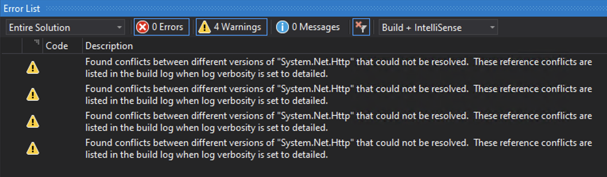

## Migrating .net 4.5 project to .net 4.6

1. Right click on project and select **properties** from the context menu.
2. On the property page select **Application** tab 
3. On the application tab change target framework from **.NET Framework 4.5** to **.NET Framework 4.6**
4. On changing framework, it will open a dialog box, click Ok.
5. Build Solution. It may result into follow warning/error.
   
6. To resolver above mentioned warnings/errors, fire following command in the **Visual Studio Package Manager Console**
   ```
   Update-Package -Reinstall
   ```
7. As a result of the above command, package.config get updated (notice change in tagetFramework) 
   From
   ```
   <package id="FluentAssertions" version="3.3.0" targetFramework="net45" />
   ```
   to
   ```
   <package id="FluentAssertions" version="3.3.0" targetFramework="net46" />
   ```
8. Clean and Rebuild the solution.
9. The older warnings/errors are gone, however new warning shown below appears
   
10. To findout detail about these conflict set build log verbosity to detailed and rebuild the solution.
11. After looing at the detail log it is found that conflict is due to different version of dlls are being referred by main project and other libraries referred in the projects.
12. Three of the warning can be removed by just removing reference to the conflicted assembly and one of them removed by updating reference to the higher version of assembly via nuget.

