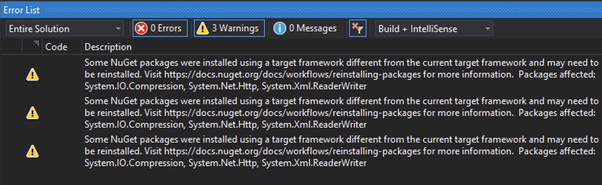

## Migrating .net 4.5 project to .net 4.6

1. Right click on project and select **properties** from the context menu.
2. On the property page select **Application** tab 
3. On the application tab change target framework from **.NET Framework 4.5** to **.NET Framework 4.6**
4. On changing framework, it will open a dialog box, click Ok.
5. Build Solution. It may result into follow warning/error.
   

```markdown
Syntax highlighted code block

# Header 1
## Header 2
### Header 3

- Bulleted
- List

1. Numbered
2. List

**Bold** and _Italic_ and `Code` text

[Link](url) and 
```

For more details see [GitHub Flavored Markdown](https://guides.github.com/features/mastering-markdown/).

### Jekyll Themes

Your Pages site will use the layout and styles from the Jekyll theme you have selected in your [repository settings](https://github.com/101v/dotnet_migration/settings). The name of this theme is saved in the Jekyll `_config.yml` configuration file.

### Support or Contact

Having trouble with Pages? Check out our [documentation](https://help.github.com/categories/github-pages-basics/) or [contact support](https://github.com/contact) and we’ll help you sort it out.
